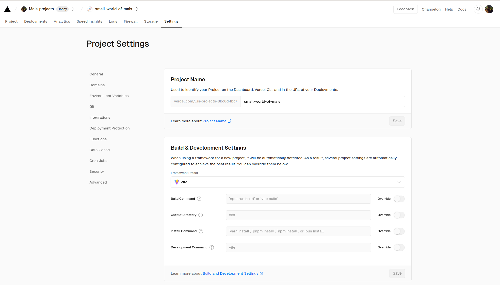

## Project info

Huge thank you to Mais Hatem (www.maishatem.com) for providing so much of the inspiration for this website!

This project uses:
- CSS & Flexbox (Useful resource for learning: Flexbox Froggy https://flexboxfroggy.com/)
- React & React router
- Fonts: Google Fonts
- Emoji favicon from: https://favicon.io/emoji-favicons/ (did not use https://realfavicongenerator.net/)

Other useful options:
- Domain: GoDaddy
- Hosting: Vercel
- Tools for design: Figma (Figma community)
- Inspiration: Dribble, Behance
- Color palettes: Any color generator tool, e.g., https://coolors.co/ 
- CSS grid tutorial from Froggy's creator (https://codepip.com/games/grid-garden/)

## Project requirements

On a Mac or Linux machine, run this project by using the following Node and npm versions:
* Node `v22.7.0`
* npm `10.8.3`

## Usage guide

### Local testing

1. Install dependencies: `npm install`
1. Place your `.md` files in a directory called `md/` in the project root then run:

    ```
    npm run generate-file-lists
    ```
    This will generate `blogFiles.json` and `recipesFiles.json`; a list of the files names the front-end will eventually parse. 

    NOTE: Currently, the `md/` directory has placeholder blogs (Blog 1, 2, and 3).

1. Run the dev server: `npm run dev`


### Deployment

Mais is using Vercel for Serverless deployments and CI/CD on GitHub. The free tier is ok as long as the website does not run ads / make profit.
GitHub pages are a nice alternative if only they worked on [private repos](https://docs.github.com/en/pages/getting-started-with-github-pages/about-github-pages).

The files `vercel.json` and `vite.config.js` are essential for Vercel to be able to run the right build script.

Mais' settings on Vercel (also see ../screenshots/vercel-project-settings.png):

<p float="left">
  
</p>

Last update: 2024-10-28


